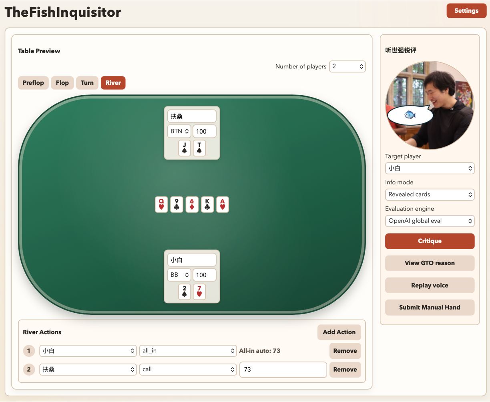

# TheFishInquisitor (审鱼者)



TheFishInquisitor is a local-first Texas Hold'em hand review app focused on fast replay + sharp critique.

It is designed for post-hand discussion and structured strategy improvement:
- build a complete hand directly on a visual poker table (2-9 players),
- evaluate a player‘s move with GTO (Game Theory Optimization)-oriented logic,
- output a short Shiqiang's (the developer's roommate, an aspiring poker player) roast line,
- auto-play the critique voice immediately,
- reveal technical reasons on demand.

## Core Features

- **Table-first editing**
  Edit players, positions, stacks, hole cards, board cards, and street actions directly from the table scene.
- **Two input paths**
  Manual builder is primary; prompt parsing remains available through the structured parser path.
- **Street-by-street action timeline**
  Preflop/Flop/Turn/River each have independent action editing with add/remove controls and action ordering.
- **Targeted critique**
  Evaluate one selected player at a time with configurable information mode.
- **Voice playback**
  Critique can be spoken immediately after evaluation and replayed from the control panel.
- **Extensible evaluation engine**
  Current MVP includes local rule heuristics and OpenAI evaluation wiring, with interfaces ready for future solver adapters.

## Quick Start

```bash
npm install
npm run dev
```

Open the local Vite URL and use the app directly in the browser.

## Recommended Runtime

- Node.js `18+` (or `20+` preferred)
- npm `9+`
- Modern browser with Web Speech/Web Audio support (Chrome recommended)

## Manual Builder Flow

1. Set **Number of players** and edit seats directly on the table (name/position/stack/hole cards).
2. Click board cards in the center to set flop/turn/river cards.
3. Use street tabs (**Preflop / Flop / Turn / River**) to set each player's action and sizing.
4. Use the right **Critique Control** panel to choose target player and info mode.
5. Click **Critique** for immediate voice playback.

Validation rules:
- duplicate cards are rejected,
- duplicate positions are rejected,
- call/bet/raise/all-in actions require a positive amount.

## Settings

- Open **Settings** (top-right corner).
- Paste your **OpenAI API key**.
- Choose voice mode and voice option for critique playback.
- Optional avatar asset path:
  - put your image at `public/assets/shiqiang.png`

## Use with OpenAI

1. Start app with `npm run dev`.
2. Paste your OpenAI API key in **Settings**.
3. Trigger critique from the right-side control panel.

## Project Structure

```text
src/
  components/            UI panels and table widgets
  components/manual/     table editor, player cards, board/actions editors
  lib/parser/            manual + prompt parsing and schema guards
  lib/evaluation/        rule engine, evaluator interface, model evaluator
  lib/commentary/        style-constrained short critique generation
  lib/voice/             browser/cloud TTS orchestration
  types/                 shared poker domain contracts
tests/
  unit/                  parser/evaluator/commentary/tts tests
  components/            React component behavior tests
  e2e/                   smoke-path app tests
```

## Development Commands

```bash
npm run dev      # run local app
npm run test     # run tests
npm run build    # production build check
```

## API Key Handling (MVP)

- API key input is kept in memory only.
- No persistence is implemented in this MVP.
- Frontend-only architecture means browser-side key exposure risk remains.

## Roadmap Direction

- richer GTO diagnostics and confidence display,
- plug-in solver adapter behind existing evaluator interface,
- stronger hand-history import/parsing,
- improved voice provider options and reliability diagnostics.
